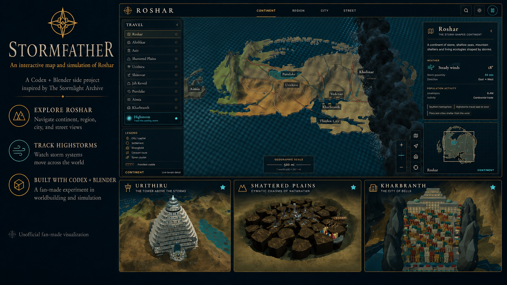

# Stormfather — a living atlas of Roshar

Stormfather v2 is an unofficial, reference-informed 3D atlas built with React, Three.js and TypeScript. Explore the registered continental coastline, enter sixteen original local reconstructions, watch inhabitants and native creatures, and consult the sources behind each place.

## The new version

- A coastline-constrained relief map, north-up comparison camera, place labels, optional political borders and searchable gazetteer.
- Sixteen detailed places: Urithiru, Kholinar, Kharbranth, Thaylen City, Azimir, Shattered Plains, Shinovar, Purelake, Vedenar, Akinah, Yeddaw, Sesemalex Dar, Hearthstone, Revolar, Kasitor and Rall Elorim.
- A continuous map: scroll into cities at their registered anchors and pull back to the continent. Terrain joins replace isolated model stages. City footprints are enlarged for exploration.
- Metric city models with distinct overview, street, wildlife and Radiant cameras. Published silhouettes and plan relationships guide the models; fine building layouts are interpretations.
- Articulated inhabitants with occupation props, routes checked against building volumes, endpoint activities and storm shelter behavior.
- Six original creature rigs: chull, axehound, chasmfiend, skyeel, goat and cremling; fish shoals in the Purelake and twelve blue-uniformed Windrunners patrolling Urithiru’s western approaches, with a separate Radiants layer and follow camera.
- A Scenes browser with a coordinated 40-person bridge run, a lure-and-withdrawal chasmfiend hunt, and a listener settlement with workform routines, paired warform patrols and communal rhythms.
- All ten Radiant orders in an illustrative Urithiru practice court, with flight, gliding, illusions, plant growth, Soulcasting and stone-working demonstrations. Close/wide views keep the powers legible.
- Ten in-world curiosities with persistent discovery notes.
- Shared pause/speed controls, daylight, a volumetric east-to-west highstorm with a following camera, branching lightning and windblown debris, local rain, retracting chulls and rockbuds, and receding Purelake water.
- Responsive HUD, searchable destinations, keyboard controls, source notes and downloadable GLB models.

The generated concept in `docs/concepts/v2` is **not** a geographic reference. Its invented map was rejected. The implementation uses registered cartography and actual published drawings. See the [reference ledger](docs/research/v2-references.md) for evidence, orientation corrections and reconstruction limits. In particular, Akinah’s continental marker identifies the Aimia region rather than claiming a surveyed island location. Records with unknown geography receive no invented map pin.

## Run locally

Node.js 22 or newer:

```bash
npm install
npm run dev -- --host 127.0.0.1
```

Open the address printed by Vite, normally `http://127.0.0.1:5173/`.

## Controls

| Control | Action |
| --- | --- |
| Drag / one finger | Orbit |
| Right drag / two fingers | Pan |
| Wheel / pinch / + and − | Zoom |
| Scroll toward a city / destination label | Zoom or fly into its integrated reconstruction |
| Overview / Street view / Wildlife / Radiants | Study architecture, street life, native creatures or Urithiru’s patrol |
| Scenes | Launch a living-world activity; choose any Radiant order in The ten orders |
| Scenes → Curiosities | Follow hints, then inspect the actual object to record a discovery |
| Compass | North-up view |
| Space | Pause or resume the living world |
| `/` or Ctrl/⌘ K | Search |
| Highstorm | Start or clear the storm; choose “Follow the stormwall” to ride along |
| Field notes | Read sources and download the current model |
| Escape | Dismiss notes, help or layers |

The atlas uses interpreted terrain relief with coast-to-sea tapering. Cities stay in one world at their registered anchors; their metric models use an enlarged display scale of up to 0.002 atlas units per metre, not a claimed geographic footprint. Adjacent Azimir and Yeddaw use 0.0011 to keep their terrain footprints apart without moving their registered anchors. Local models use metres, with humans approximately 1.6–1.95 m tall. This is an illustrative fan reconstruction rather than a surveyed landscape or a full city traffic simulation. Intact cities are shown without asserting one exact canonical date.

## Model kit

```bash
npm run export:v2
npm run validate:v2
```

This deterministically rebuilds sixteen place models, six articulated creature rigs and fourteen humanoid rigs (ten orders, workform, warform, bridge crew and hunter) in `public/models/v2`. `manifest.json` records units, geometry statistics, route counts and source identifiers (resolved in `src/atlas/data.ts`). The 36 GLBs contain static geometry and articulated limb hierarchies; the app supplies behavior, animation, Surge effects and weather at runtime. Custom procedural material grain is a renderer effect and is not baked into the GLBs. The kit is downloaded on demand; the atlas builds its scene locally and does not fetch all model files at startup.

## Development checks

```bash
npm run typecheck
npm test
npm run lint
npm run build
```

Tests cover the retained cartographic/gazetteer foundations and new simulation, model navigation and HUD behavior. The test runner limits workers to avoid oversubscribing memory during geometry checks.

`src/main.tsx` mounts the new `src/atlas/App.tsx`. The previous renderer (`src/App.tsx`, `src/world`, `src/ui`) and original Blender kit remain in the repository; v2 reuses their geographic datasets but has its own scene, HUD, models and simulation. Legacy asset validation remains available through `npm run validate:assets`.

Stormlight Archive, Roshar and related names belong to Brandon Sanderson and Dragonsteel Entertainment. This project is not endorsed by or affiliated with them. New code and model geometry are original fan work; linked reference artwork belongs to its respective creators. Reference pages can contain spoilers.
